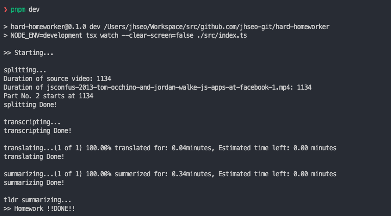

Haaaaard worker!

see [index.ts](./src/index.ts)

## motivation

Personally

- I can read English to a certain extent, but my listening skills are definitely limited,
- I have to spend at least twice as much time listening as I do in Korean to understand the context,
- AI performance has improved tremendously in recent years,

## input

- YouTube videos are the main target
- Can also be MP4, etc.

## output

- [x] Full speech transcribed to text
- [x] Transcript translated into Korean
- [x] Speech summary

## stack

nodejs + typescript

- downloader
  - [ytdl-core](https://github.com/fent/node-ytdl-core)
  - https://github.com/fent/node-ytdl-core/blob/master/example/ffmpeg.js
- ffmpeg: split vidoes
  - [ffmpeg](https://ffmpeg.org/)
- tokenizer
  - [@dqbd/tiktoken](https://github.com/dqbd/tiktoken)
- transcription
  - [openai api whisper](https://platform.openai.com/docs/guides/speech-to-text)
- translator
  - [openai api chatcompletion](https://platform.openai.com/docs/guides/gpt/chat-completions-api)
  - [deepl api](https://www.deepl.com/docs-api)

## process

- [x] script run

- [ ] github action

0. Enter the destination YouTube address (method to be determined)
1. download the YouTube video
2. Separate the video according to the API specification (maxBodyLength)
3. convert video (voice) to text
4. translate text (mainly English) into Korean
5. save the translated text in Korean
